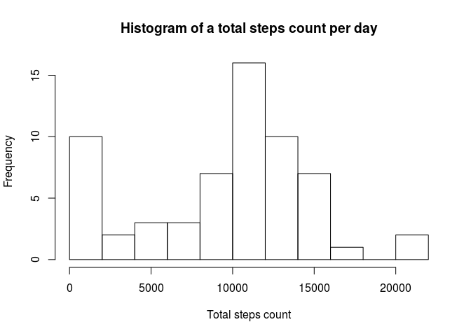
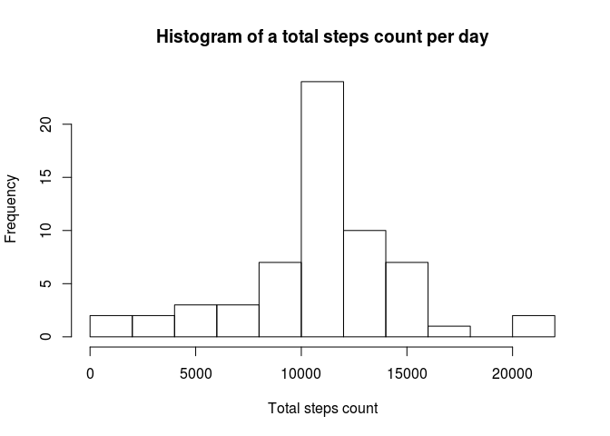
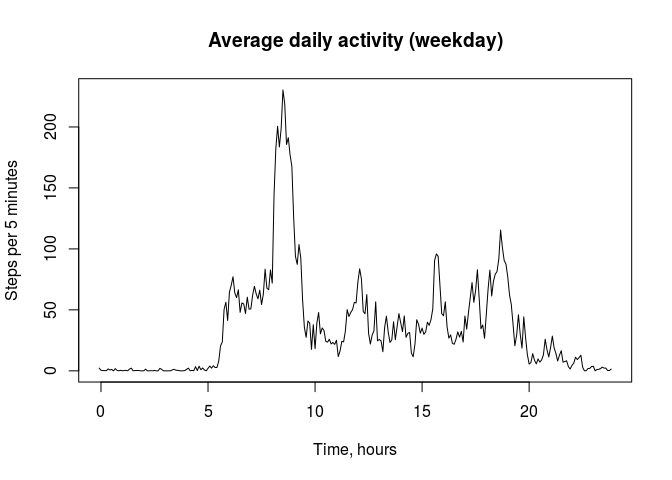

# Reproducible Research: Peer Assessment 1
Loading auxillary libs and files

```r
    library('dplyr')
```

```
## 
## Attaching package: 'dplyr'
```

```
## The following objects are masked from 'package:stats':
## 
##     filter, lag
```

```
## The following objects are masked from 'package:base':
## 
##     intersect, setdiff, setequal, union
```

```r
    source('buildTimeSeries.R')
```

## Loading and preprocessing the data
Unpacking and reading the data

```r
    #Unzipping and reading the data
    unzip('activity.zip')
    repData <- read.csv('activity.csv')
```
Grouping the data by date and building the total steps by day histrogram

```r
    #Grouping the data
    repDataByDate <- group_by(repData, date)
    repDataByDate <- summarise(repDataByDate, stepsByDate = sum(steps, na.rm = TRUE))
    hist(repDataByDate$stepsByDate, main = "Histogram of a total steps count per day", xlab = "Total steps count", breaks = 10)
```



## What is mean total number of steps taken per day?
Calculating the mean and median of total steps by days

```r
    mean(repDataByDate$stepsByDate)
```

```
## [1] 9354.23
```

```r
    median(repDataByDate$stepsByDate)
```

```
## [1] 10395
```
The distribution mean differes slightly from the medial. The distribution is skewed a little.

## What is the average daily activity pattern?
Grouping the data by Interval and converting the result to time series. The time series plot shows average activity during the day.

```r
    repDataByInterval <- group_by(repData, interval)
    repDataByInterval <- summarise(repDataByInterval, steps = mean(steps, na.rm = TRUE))
    tsData <- ts(repDataByInterval$steps, start=c(0, 0), frequency = (60 / 5))
    plot(tsData, main="Average daily activity", ylab="Steps per 5 minutes", xlab="Time, hours")
```


This interval has the largest steps count averaged by days.

```r
    maxStepsInterval <- repDataByInterval[repDataByInterval$steps == max(repDataByInterval$steps), ]$interval    
```

## Imputing missing values
This code sets averaged steps count for intervals with own NA values. It is not extremly efficient, but it works.

```r
    for (i in seq(1, length(repData$steps))) {
        if (is.na(repData[i, 'steps'])) {
            repData[i, 'steps'] = repDataByInterval[repDataByInterval$interval == repData[i, 'interval'],]$steps
        }
    }
```
This is the total steps count by date for the data without NAs interval values. It differes from the first plot.

```r
    repDataByDate <- group_by(repData, date)
    repDataByDate <- summarise(repDataByDate, stepsByDate = sum(steps, na.rm = TRUE))
    hist(repDataByDate$stepsByDate, main = "Histogram of a total steps count per day", xlab = "Total steps count", breaks = 10)
```


Interesting, but in this case the mean for total steps is equal to the median.

```r
    mean(repDataByDate$stepsByDate)
```

```
## [1] 10766.19
```

```r
    median(repDataByDate$stepsByDate)
```

```
## [1] 10766.19
```
## Are there differences in activity patterns between weekdays and weekends?
Creating an additional columns in the original dataset based on if given date is a weekday or a weeend. There are two russian locale constand for days of a week, they are belong to weekend (saturday and sunday)

```r
    repDataExt <- mutate(repData, weekend = (weekdays(as.POSIXlt(date)) == "Суббота" | weekdays(as.POSIXlt(date)) == "Воскресенье"))
    repDateWeekday <- filter(repDataExt, !weekend)
    repDateWeekend <- filter(repDataExt, weekend)
    
    repDateWeekdayTS <- buildTimeSeries(repDateWeekday)
    repDateWeekendTS <- buildTimeSeries(repDateWeekend)
```
This is a panel plot for dayily activity for weekday and weeked. It is interesting, dayly activity in weekday lookes like total daily activity.

```r
    par(mfrow=c(1, 2))
    plot(repDateWeekdayTS, main="Average daily activity (weekday)", ylab="Steps per 5 minutes", xlab="Time, hours")
    plot(repDateWeekendTS, main="Average daily activity (weekend)", ylab="Steps per 5 minutes", xlab="Time, hours")
```




